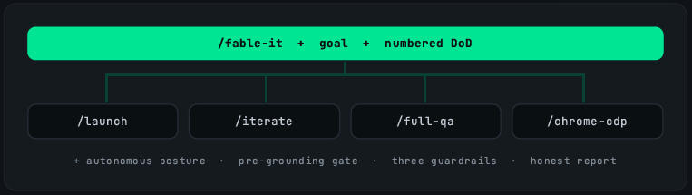

<div align="center">

<h1>/fable-it</h1>

<h3>
  <strong>Make Opus behave like Fable</strong>
</h3>

<p>
  Hand Claude a goal and a numbered Definition of Done.<br>
  <strong>Go to sleep. Wake up to an honest report.</strong>
</p>

<p>
  <em>Behavior transfers. That's what makes overnight jobs survivable.</em>
</p>


<a href="#how-it-works">
  
</a>

<p>
  <a href="#installation"></a>
  <a href="https://opensource.org/licenses/MIT"></a>
  <a href="https://claude.ai/code"></a>
  <a href="https://claude.ai/code"></a>
  <a href="https://github.com/DevOtts"></a>
</p>


<p>
  <a href="#installation">Install</a>
  &nbsp;·&nbsp;
  <a href="#the-honest-claim">The honest claim</a>
  &nbsp;·&nbsp;
  <a href="#how-it-works">How it works</a>
  &nbsp;·&nbsp;
  <a href="#whats-bundled">What's bundled</a>
  &nbsp;·&nbsp;
  <a href="#platform-compatibility">Platform compatibility</a>
</p>


> [!NOTE]
> **Optimized for long tasks** — research, browser tasks and mainly **vibe coding**.

<br>
</div>

When you watch Fable run a long, multi-step task, the thing that stands out isn't raw cleverness. It's that it **holds the thread**: it doesn't contradict a decision it made an hour ago, it tests its own work before claiming it's done, it reports honestly when it couldn't verify something, and it doesn't wander off building things you never asked for.

That's *behavior*, not IQ — and behavior transfers. fable-it packs those behaviors into a single Claude Code skill, so Opus runs long, unattended jobs the way Fable does.

## The honest claim

It does **not** turn Opus into Fable, and anyone who tells you a skill can do that is selling something. It makes Opus **behave** like Fable on long work — which is most of what you actually felt when you used Fable.

| Ports to Opus ✓ | Stays with Fable ✕ |
|---|---|
| Coherence across a long run, holding early constraints | Raw reasoning ceiling on genuinely hard problems |
| Self-verification before declaring a step done | One-shotting a complex system from a thin prompt |
| Honest, evidence-backed progress reporting | The deepest long-context retention quality |
| Autonomous-turn discipline, no needless pausing | Anything that comes from the weights, not the prompt |
| Restraint — doing the job, not inventing scope | |

The line is real. But the part that ports over is the part that makes overnight jobs survivable: your Opus runs them far more like Fable than it did yesterday.

## Installation

fable-it ships as both a **Claude Code plugin** and a standard repo-root **`SKILL.md`**, so it installs across the whole agent ecosystem. Pick your tool below.

> [!TIP]
> **Two universal installers** understand the `SKILL.md` standard and drop fable-it into the right directory for 70+ tools — use these if your agent isn't listed:
> ```sh
> npx skills add DevOtts/fable-it -a <agent>   # e.g. -a codex, -a cursor, -a github-copilot ; add -g for global
> gh skill install DevOtts/fable-it            # GitHub CLI (project or user scope)
> ```
> Peek first with `npx skills add DevOtts/fable-it --list`.

### Claude Code  ·  *native, full experience*

```sh
# 1. Register the marketplace
/plugin marketplace add DevOtts/fable-it

# 2. Install the plugin (plugin-name@marketplace-name)
/plugin install fable-it@devotts
```

The marketplace name `devotts` comes from the `name` field in [marketplace.json](.claude-plugin/marketplace.json). This is the **only** target that gets the full bundle — the conductor *plus* `launch`, `iterate`, `full-qa` and `chrome-cdp-control`, with slash-command invocation and auto-activation. (Skills-CLI alternative: `npx skills add DevOtts/fable-it -a claude-code`.)

### Codex  ·  *OpenAI Codex CLI*

```sh
npx skills add DevOtts/fable-it -a codex
# or:  gh skill install DevOtts/fable-it
```

Installs to the shared `.agents/skills/fable-it/` that Codex reads. Codex doesn't carry the bundled sibling skills, so fable-it runs the launch/iterate/QA phases **inline** (graceful degradation) — you still get the autonomous posture, pre-grounding gate, coherence guardrails and the honest per-criterion report.

### OpenClaw

```sh
npx skills add DevOtts/fable-it -a openclaw
```

Lands in `.openclaw/skills/fable-it/SKILL.md`.

### Cursor

```sh
npx skills add DevOtts/fable-it -a cursor      # add -g for a global install
```

Installs into Cursor's `.agents/skills/` and is auto-discovered.

### VS Code + GitHub Copilot

```sh
npx skills add DevOtts/fable-it -a github-copilot
# or:  gh skill install DevOtts/fable-it
```

Copilot auto-discovers skills under `.agents/skills/`.

### Copilot CLI

```sh
gh skill install DevOtts/fable-it
# or:  npx skills add DevOtts/fable-it -a github-copilot
```

### Kiro CLI / IDE

```sh
gh skill install DevOtts/fable-it
```

If your Kiro build doesn't yet read the shared skills path, drop the skill in manually:

```sh
git clone https://github.com/DevOtts/fable-it /tmp/fable-it
mkdir -p "<kiro-skills-dir>/fable-it" && cp /tmp/fable-it/SKILL.md "<kiro-skills-dir>/fable-it/"
```

### Others  ·  *OpenCode · Cline · Windsurf · Zed · Gemini CLI · Antigravity · Amp · Warp …*

```sh
npx skills add DevOtts/fable-it -a <agent>
```

Run `npx skills add DevOtts/fable-it --list`, then target your agent — the CLI knows the correct path for each. **Manual fallback for any tool:** clone the repo and copy the root [`SKILL.md`](SKILL.md) into your agent's skills/instructions directory.

> [!NOTE]
> On every target **except Claude Code**, fable-it installs as a single behavior skill (the root `SKILL.md`). The delegated `/launch`, `/iterate`, `/full-qa` and `/chrome-cdp-control` are Claude Code plugin skills; elsewhere fable-it executes those phases inline and notes the absence in its report. The thing that ports everywhere is the **behavior** — and that's the whole point.

## How it works

You hand fable-it a **goal** and a **numbered Definition of Done**. It does the rest — unattended.

```
Goal: Ship the Shopify → Postgres sync for the analytics dashboard.

DoD:
1. Shopify orders sync to postgres.orders with correct schema
2. Incremental sync works (only new orders since last run)
3. Dashboard /analytics page shows real data, not mocks
4. All three pass in the QA report
```

fable-it is a **conductor, not a replacement**. If you already run Claude Code with skills like `/launch`, `/iterate`, `/full-qa` and `/chrome-cdp-control`, it routes each piece of work to the right one at the right moment — and never pastes a worse copy of their logic. Improve `/iterate`, and fable-it inherits the improvement.




On top of routing, it enforces the layer that otherwise gets hand-written into every overnight prompt:

- **Autonomous posture** — keeps moving instead of stopping to ask permission, clamped by two counter-rules: don't fake confidence, don't gold-plate. Irreversible actions still need prior authorization.
- **Pre-grounding gate** — reads the real source of truth (the actual schema, the real endpoint) *before* writing a line of code, so hour-3 work doesn't drift from hour-1 reality.
- **Three coherence guardrails** that stop long, parallel runs from quietly falling out of sync:
  1. **Shared decision contract** — parallel agents read and write one shared file for every cross-cutting decision, so a renderer is never built for schema A while a connector saves schema B.
  2. **Cross-session interface file** — when this run assumes work another session is still building, it writes the contract both sides agree on instead of guessing.
  3. **Honest per-criterion status** — every DoD item gets a state with evidence: `VERIFIED`, `IMPLEMENTED-NOT-VERIFIED`, or `BLOCKED`. No green result is ever reported off a mock or an assumption.

The coherence problem on long jobs isn't raw capability — it's decisions made in hour 1 contradicting work done in hour 3. The guardrails exist for exactly that.

## Use

You don't have to type a command — the skill **auto-activates** when you describe a goal-to-DoD delivery:

> *"work autonomously until done"* · *"I'm going to bed, finish this"* · *"run to DoD"* · *"green light, take decisions"* · or a goal followed by numbered acceptance criteria.

To invoke it explicitly (plugin skills are namespaced by the plugin name):

```
/fable-it:fable-it Build the Shopify multi-store connector.
  DoD:
  1. Backfill shows all records in connector-logs
  2. Pooling enabled in UI, records appear in logs
  3. New interactions visible on the timeline page
  4. ShopifyRenderer shows details for a clicked item
```

Only two things are required: the **goal** and a **numbered DoD**. Everything else has a sensible default — credentials, tooling inferred from the DoD, parallelism, report location. The status report and any credentials artifact are written to `.fable-it-reports/` at the workspace root (not the repo root), so the run leaves a clean tree behind — `.gitignore` that one folder if you'd rather not track it. It's built to run unattended: a long silence means it's working, not stuck.

## What's bundled

| Skill | Role |
|-------|------|
| `fable-it` | The conductor — owns posture, guardrails, and the final report |
| `launch` | Mission control: environment inventory, approach selection, agent topology |
| `iterate` | Diagnosis → fix → test → evaluate cycles |
| `full-qa` | Autonomous QA suite: reads a test plan, runs CDP + iterate, produces a pass/fail report |
| `chrome-cdp-control` | Step-by-step control of your real, logged-in Chrome via Playwright over CDP |

Because the skills it delegates to ship inside the plugin, there are no missing dependencies. And if a delegated skill is absent in some environment, fable-it **degrades gracefully** — it runs that phase inline and notes the absence in its report, rather than failing.

## What the report looks like

```
# Fable-it Report — Shopify → Postgres analytics sync
Run window: 02:14 → 05:47  |  Approach: single session

## DoD status
| # | Criterion                          | Status                    | Evidence              |
|---|------------------------------------|---------------------------|-----------------------|
| 1 | Orders sync with correct schema    | VERIFIED                  | 1,847 rows, schema ✓  |
| 2 | Incremental sync works             | VERIFIED                  | delta query confirmed |
| 3 | Dashboard shows real data          | IMPLEMENTED-NOT-VERIFIED  | service was down      |
| 4 | All three pass in QA report        | BLOCKED                   | depends on #3         |

## Recommended next actions
- Restart the dashboard service and re-run /full-qa for criterion 3
```

`VERIFIED` means real data, a real endpoint, real evidence — never a mock dressed up as a pass.

## Status

Honest, like the skill itself: this has been tabletop-tested against real prompts, not yet hammered end-to-end in every environment. Validate the plugin locally before relying on it:

```sh
claude plugin validate ./plugins/fable-it
claude plugin validate .
```

## Security considerations

- **No secrets are required to install or run the skill.** You supply credentials only for the specific job you ask it to do.
- It reads `.full.credentials` and `.env` **locally only** — these are never transmitted anywhere and are not committed.
- Browser automation uses **your own Chrome** via the Chrome DevTools Protocol (CDP) on a local port, reusing your existing logged-in session. fable-it does not store or exfiltrate your cookies or session.
- Any credential created during a run (e.g. an admin token, a registry login) is **isolated in a dedicated credentials artifact** with rotation notes — never buried inside the prose report.
- Irreversible actions (dropping tables, force-push, destructive migrations on shared/prod state) always require explicit prior authorization; autonomy covers reversible work only.

## Platform compatibility

fable-it is a `SKILL.md` at its core, so it runs anywhere the open [Agent Skills](https://github.com/vercel-labs/skills) standard does. **Claude Code** gets the full plugin (conductor **+** the four bundled skills); every other tool gets the portable **behavior layer** — posture, pre-grounding gate, guardrails and honest report — with the delegated phases running inline.

Every `skills add -a <agent>` row below is shorthand for `npx skills add DevOtts/fable-it -a <agent>` (append `-g` for a global install). Don't see your tool? Run `npx skills add DevOtts/fable-it --list` — the CLI supports 70+ agents.

| Platform | Status | Install Method |
|----------|--------|----------------|
| Claude Code | ✅ Native | Plugin marketplace |
| Cursor | ✅ Supported | Auto-discovery |
| VS Code + GitHub Copilot | ✅ Supported | Auto-discovery |
| Copilot CLI | ✅ Supported | `gh skill install` |
| Codex | ✅ Supported | `skills add -a codex` |
| OpenCode | ✅ Supported | `skills add -a opencode` |
| OpenClaw | ✅ Supported | `skills add -a openclaw` |
| Antigravity | ✅ Supported | `skills add -a antigravity` |
| Gemini CLI | ✅ Supported | `skills add -a gemini-cli` |
| Pi Agent | ✅ Supported | `skills add -a pi` |
| Vibe CLI | ✅ Supported | `skills add -a mistral-vibe` |
| Hermes | ✅ Supported | `skills add -a hermes-agent` |
| Cline | ✅ Supported | `skills add -a cline` |
| KIMI CLI | ✅ Supported | `skills add -a kimi-code-cli` |
| Trae | ✅ Supported | `skills add -a trae` |
| Nanobot | ✅ Supported | Manual — copy `SKILL.md` |
| Kiro CLI / IDE | ✅ Supported | `skills add -a kiro-cli` |
| Windsurf · Zed · Amp · Warp · Roo · Goose · Junie · Qwen · …50+ more | ✅ Supported | `npx skills add DevOtts/fable-it --list` |

**Legend** — **✅ Native:** the complete plugin (conductor + all four bundled skills, slash-command + auto-activation). **✅ Supported:** the root `SKILL.md` behavior layer installs and runs; Claude-specific delegated skills execute inline rather than being routed.

## License

MIT — see [LICENSE](LICENSE) and [plugin.json](plugins/fable-it/.claude-plugin/plugin.json). Use it, fork it, ship with it.

---

Thank you for contribution:
- [andre2654](https://github.com/andre2654)
- [mBidarra](https://github.com/mBidarra)
- [her0 Studio](https://github.com/her0-studio/)

---

_Built by [DevOtts](https://github.com/DevOtts)._